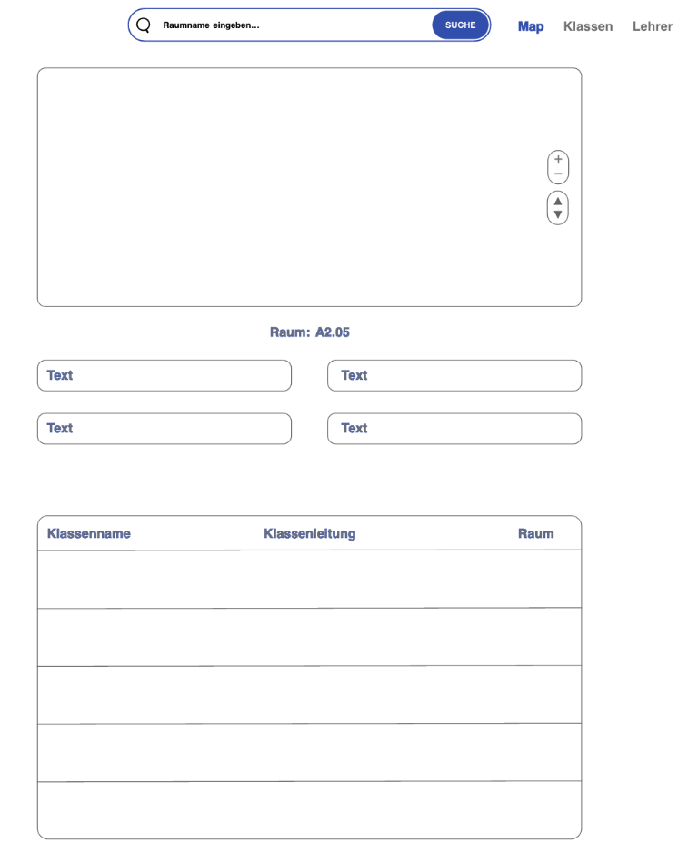
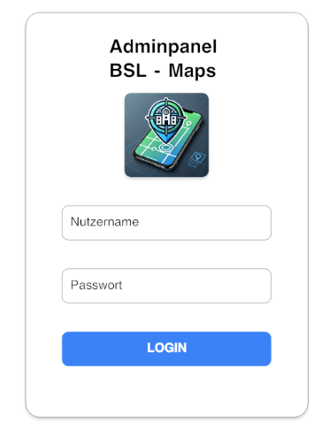
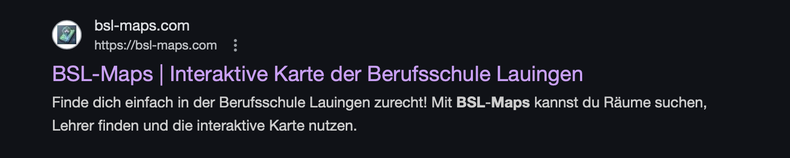
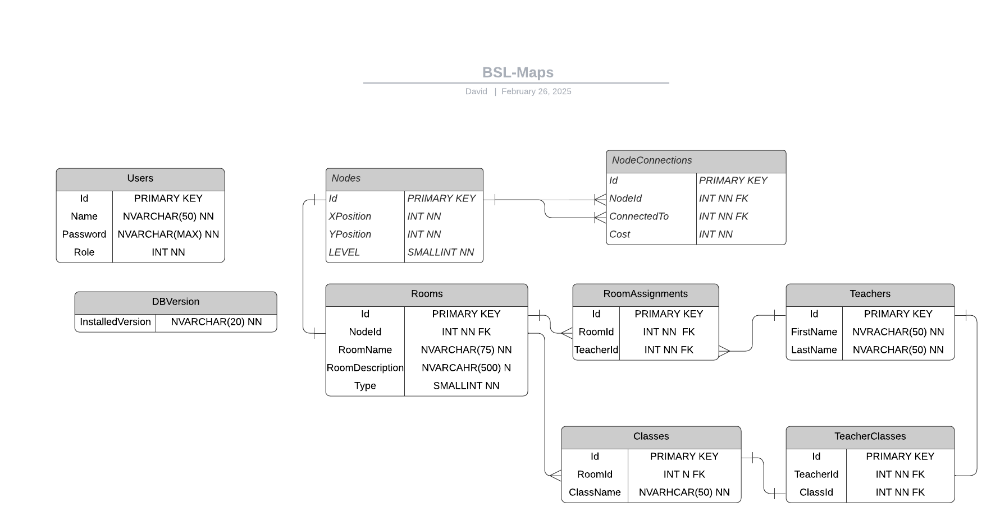
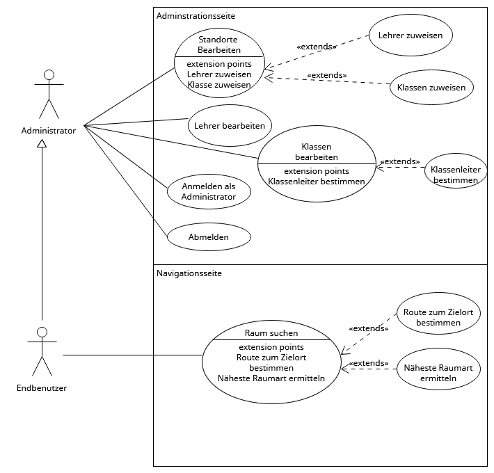
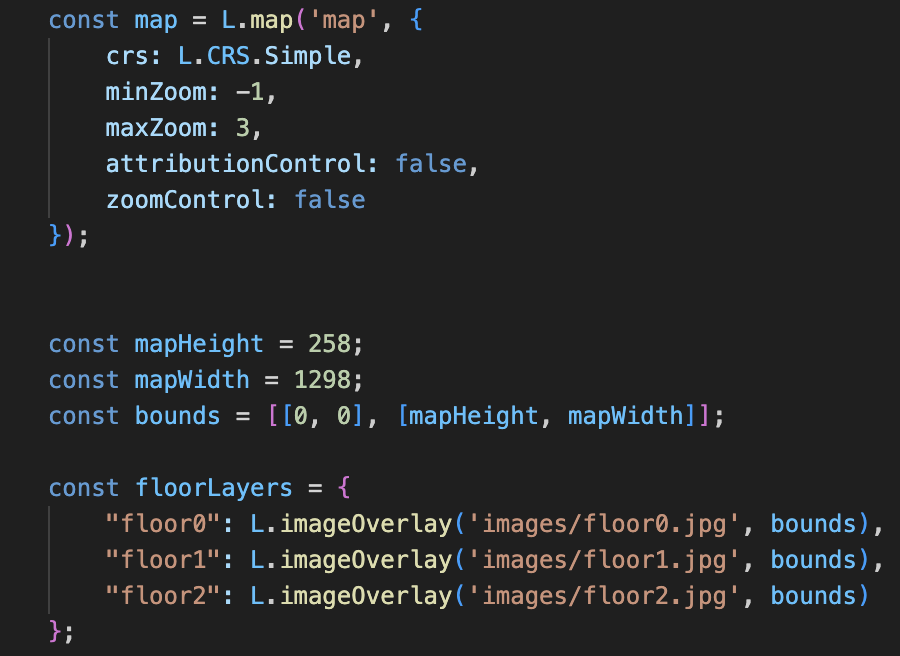

<div align="center">


# BSL Maps

### 🗺️ Indoor-Navigation für die Berufsschule Lauingen · Indoor navigation for Lauingen Vocational School


<br/>

**🌐 Sprache / Language:** **[🇩🇪 Deutsch](#-deutsch)** · **[🇬🇧 English](#-english)**

</div>

---

# 🇩🇪 Deutsch

Eine responsive Webanwendung, mit der sich Schüler, Lehrer und Besucher
schnell und zielsicher im Schulgebäude zurechtfinden – inklusive
Raumsuche, Routenplanung und einem Administrationspanel zur Datenpflege.

## 📌 Über das Projekt

**BSL Maps** ist ein IT-Ausbildungsprojekt der Klasse **EIT12A** an der
Staatlichen Berufsschule Lauingen. Ausgangspunkt war ein reales Problem:
Besucher – unter anderem aus internationalen Partnerschulen – sowie neue
Schüler und Vertretungslehrer finden sich im Schulgebäude nur schwer
zurecht und kommen dadurch zu spät zu Terminen.

Unsere Lösung ist eine **über den Browser erreichbare Indoor-Navigation**:
Auf einer interaktiven Karte lassen sich Räume suchen, auswählen und per
Routenplanung miteinander verbinden. Ein separates, nicht öffentlich
indexiertes **Adminpanel** ermöglicht die komfortable Pflege aller
Raum-, Klassen- und Lehrerdaten über eine Oberfläche statt direkt in der
Datenbank.

> 💡 Ursprünglich war eine Handy-App mit NFC-Standorterkennung und
> AR-Navigation geplant. Aus Zeit- und Budgetgründen (Deadline 28.02.2025,
> Budget ≤ 60 €) haben wir uns bewusst für eine schlanke, performante
> **Webanwendung** entschieden.

## ✨ Features

| | Feature | Beschreibung |
|---|---|---|
| 🗺️ | **Interaktive Karte** | Gebäudekarte über **drei Stockwerke** mit Zoom, Etagenwechsel und anklickbaren Raum-Markern (Leaflet.js). |
| 🔍 | **Raumsuche** | Suchleiste mit Live-Vorschlägen – der gefundene Raum wird direkt auf der Karte fokussiert und markiert. |
| 🧭 | **Routenplanung** | Start und Ziel eingeben, der optimale Weg wird berechnet und auf der Karte visualisiert. |
| ⚡ | **Schnellauswahl** | Direktzugriff auf wichtige Orte wie Ausgang, Toiletten usw. |
| 🔐 | **Adminpanel** | Verwaltung von Räumen, Klassen und Lehrern mit JWT-Login und rollenbasiertem Zugriff. |
| 📱 | **Responsive & barrierefrei** | Optimiert für Desktop und Smartphone, hohe Ladegeschwindigkeit und gute Zugänglichkeit. |

## 🖥️ Einblicke in die Anwendung

<table>
  <tr>
    <td width="60%" valign="top">
      <b>Navigations- / Startseite</b><br/>
      Kartenansicht mit Suchleiste, Rauminfos und Datentabellen.
      <br/><br/>
      
    </td>
    <td width="40%" valign="top">
      <b>Adminpanel-Login</b><br/>
      Geschützter Zugang über JWT-Authentifizierung.
      <br/><br/>
      
    </td>
  </tr>
</table>

<sub>Die Abbildungen zeigen die in Adobe XD erstellten UI-Entwürfe, die als Grundlage der Umsetzung dienten.</sub>

**Auffindbar über Suchmaschinen** – die SEO-optimierte Startseite:



## 🏗️ Architektur & Technologie

Die Anwendung besteht aus **drei Komponenten** auf Basis von **.NET 8**:

```
┌─────────────────────┐     ┌─────────────────────┐
│  Adminpanel         │     │  Navigation +       │
│  (Blazor Server)    │     │  Homepage           │
│                     │     │  (Blazor Server)    │
└──────────┬──────────┘     └──────────┬──────────┘
           │                           │
           └───────────┬───────────────┘
                       ▼
          ┌─────────────────────────┐
          │  Backend                │
          │  C#-Klassenbibliothek   │
          │  Services · Repositories│
          │  Dapper (ORM)           │
          └────────────┬────────────┘
                       ▼
          ┌─────────────────────────┐
          │  Microsoft SQL Server   │
          │  (gehostet auf IONOS)   │
          └─────────────────────────┘
```

| Bereich | Technologie |
|---|---|
| **Frontend** | Blazor Server (2 Web-Apps), Razor Components |
| **Karte** | Leaflet.js mit `L.CRS.Simple` (pixelbasierte Gebäudepläne) |
| **Backend** | C#-Klassenbibliothek (Services, Repositories, DTOs) |
| **Datenzugriff** | Dapper (ORM) + `Microsoft.Data.SqlClient` |
| **Datenbank** | Microsoft SQL Server, versioniert per Installations-Skripten |
| **Authentifizierung** | JWT (im Cookie gespeichert), rollenbasierter Zugriff (RBAC) |
| **Hosting / Deployment** | IONOS, Veröffentlichung via FTP-Publish-Profil (Visual Studio) |

### 🗄️ Datenbankmodell

Relationales Schema mit Räumen, Knoten (für die Wegfindung), Klassen,
Lehrern und deren Zuweisungen. Eine `DBVersion`-Tabelle ermöglicht
versionierte Datenbank-Updates.



### 👥 Anwendungsfälle



## 🧩 Technisches Highlight – Karteninitialisierung

Die Karte nutzt Bilder der einzelnen Stockwerke als Overlays und ein
einfaches Pixel-Koordinatensystem statt Geo-Koordinaten. Die Raumdaten
werden aus dem C#-Backend als JSON an die JavaScript-Funktion übergeben:



## 📊 Qualität & Performance

Getestet mit **Google PageSpeed Insights** – mit Fokus auf Ladezeit,
Barrierefreiheit und SEO:

<table>
  <tr>
    <td align="center"><b>Homepage</b><br/></td>
  </tr>
  <tr>
    <td align="center"><b>Kartenansicht</b><br/></td>
  </tr>
  <tr>
    <td align="center"><b>Adminseite</b><br/></td>
  </tr>
</table>

**Weitere Teststufen:**

- ✅ **Unit-Tests** – eigener C#-`TestClient` (Konsolenanwendung) zum
  isolierten Testen der Backend-Klassenbibliothek.
- ✅ **Integrationstests** – End-to-End-Tests mit **Cypress**
  (Navigation, Suche, Routenberechnung, Adminfunktionen, Fehlerszenarien).
- ✅ **Performance & Barrierefreiheit** – Bild-/Skript-Optimierung,
  Caching, Farbkontraste, Tastaturnavigation und Screenreader-Kompatibilität.

## 🛠️ Eingesetzte Werkzeuge

| Kategorie | Tools |
|---|---|
| **Entwicklung** | Visual Studio 2022, Visual Studio Code |
| **Datenbank** | SQL Server Management Studio, DBeaver, SQLite (lokal) |
| **Design** | Adobe XD (Mockups), Photoshop (Kartenmaterial) |
| **Diagramme** | Lucidchart (DB-Modell), Umletino (UML) |
| **Organisation** | Redmine (Projektmanagement), GitHub (Versionskontrolle) |

## 📁 Projektstruktur

```
.
├── README.md                     – dieses Dokument
├── SECURITY.md                   – Sicherheitsrichtlinie & Meldeverfahren
├── assets/                       – Bilder & Diagramme für die Doku
└── Files/
    ├── Dokumentation.docx        – ausführliche Projektdokumentation
    └── Präsentation.pptx         – Projektpräsentation
```

> 📄 Die vollständige **Projektdokumentation** findest du unter
> [`Files/Dokumentation.docx`](Files/Dokumentation.docx), die Präsentation
> unter [`Files/Präsentation.pptx`](Files/Präsentation.pptx).

## 👨‍💻 Team

Entwickelt im Rahmen der Ausbildung (Klasse **EIT12A**) an der
Staatlichen Berufsschule Lauingen:

| | Entwickler | GitHub |
|---|---|---|
| 👨🏾‍💻 | **Paul Bischoff** | [@PaulPaulus123](https://github.com/PaulPaulus123) |
| 👨🏻‍💻 | **David Kramer** | [@thatdavid0451](https://github.com/thatdavid0451) |
| 👨🏽‍💻 | **Marc Rettinger** | [@Marc12341](https://github.com/Marc12341) |

**Zeitraum:** November 2024 – Februar 2025 · **Deployment:** IONOS (`bsl-maps.com`)

## 🔐 Sicherheit

Sicherheitslücken bitte vertraulich melden – Details und Meldeverfahren
findest du in der [`SECURITY.md`](SECURITY.md).

<div align="right"><a href="#bsl-maps">⬆️ Nach oben</a></div>

---

# 🇬🇧 English

A responsive web application that helps students, teachers and visitors
find their way around the school building quickly and reliably – including
room search, route planning and an admin panel for maintaining the data.

## 📌 About the project

**BSL Maps** is an IT training project by class **EIT12A** at the
Lauingen State Vocational School (Germany). It started from a real-world
problem: visitors – including guests from international partner schools –
as well as new students and substitute teachers struggle to navigate the
building and end up arriving late to appointments.

Our solution is a **browser-based indoor navigation system**: an
interactive map lets you search for rooms, select them and connect them
via route planning. A separate, non-indexed **admin panel** makes it easy
to maintain all room, class and teacher data through a UI instead of
editing the database directly.

> 💡 Originally a mobile app with NFC location detection and AR navigation
> was planned. Due to time and budget constraints (deadline 28 Feb 2025,
> budget ≤ €60) we deliberately chose a lightweight, performant
> **web application**.

## ✨ Features

| | Feature | Description |
|---|---|---|
| 🗺️ | **Interactive map** | Building map across **three floors** with zoom, floor switching and clickable room markers (Leaflet.js). |
| 🔍 | **Room search** | Search bar with live suggestions – the matched room is focused and highlighted directly on the map. |
| 🧭 | **Route planning** | Enter start and destination; the optimal path is calculated and drawn on the map. |
| ⚡ | **Quick select** | One-tap access to key locations such as exit, restrooms, etc. |
| 🔐 | **Admin panel** | Manage rooms, classes and teachers with JWT login and role-based access. |
| 📱 | **Responsive & accessible** | Optimized for desktop and mobile, fast load times and strong accessibility. |

## 🖥️ Application preview

<table>
  <tr>
    <td width="60%" valign="top">
      <b>Navigation / Start page</b><br/>
      Map view with search bar, room details and data tables.
      <br/><br/>
      
    </td>
    <td width="40%" valign="top">
      <b>Admin panel login</b><br/>
      Protected access via JWT authentication.
      <br/><br/>
      
    </td>
  </tr>
</table>

<sub>The images show the UI designs created in Adobe XD that served as the basis for implementation.</sub>

**Discoverable via search engines** – the SEO-optimized start page:


## 🏗️ Architecture & technology

The application consists of **three components** built on **.NET 8**:

```
┌─────────────────────┐     ┌─────────────────────┐
│  Admin panel        │     │  Navigation +       │
│  (Blazor Server)    │     │  Homepage           │
│                     │     │  (Blazor Server)    │
└──────────┬──────────┘     └──────────┬──────────┘
           │                           │
           └───────────┬───────────────┘
                       ▼
          ┌─────────────────────────┐
          │  Backend                │
          │  C# class library       │
          │  Services · Repositories│
          │  Dapper (ORM)           │
          └────────────┬────────────┘
                       ▼
          ┌─────────────────────────┐
          │  Microsoft SQL Server   │
          │  (hosted on IONOS)      │
          └─────────────────────────┘
```

| Area | Technology |
|---|---|
| **Frontend** | Blazor Server (2 web apps), Razor components |
| **Map** | Leaflet.js with `L.CRS.Simple` (pixel-based floor plans) |
| **Backend** | C# class library (services, repositories, DTOs) |
| **Data access** | Dapper (ORM) + `Microsoft.Data.SqlClient` |
| **Database** | Microsoft SQL Server, versioned via install scripts |
| **Authentication** | JWT (stored in a cookie), role-based access (RBAC) |
| **Hosting / Deployment** | IONOS, published via FTP publish profile (Visual Studio) |

### 🗄️ Database model

Relational schema with rooms, nodes (for pathfinding), classes, teachers
and their assignments. A `DBVersion` table enables versioned database
updates.


### 👥 Use cases


## 🧩 Technical highlight – map initialization

The map uses images of the individual floors as overlays and a simple
pixel coordinate system instead of geo-coordinates. Room data is passed
from the C# backend to the JavaScript function as JSON:


## 📊 Quality & performance

Tested with **Google PageSpeed Insights** – focusing on load time,
accessibility and SEO:

<table>
  <tr>
    <td align="center"><b>Homepage</b><br/></td>
  </tr>
  <tr>
    <td align="center"><b>Map view</b><br/></td>
  </tr>
  <tr>
    <td align="center"><b>Admin page</b><br/></td>
  </tr>
</table>

**Additional test stages:**

- ✅ **Unit tests** – a dedicated C# `TestClient` (console app) for testing
  the backend class library in isolation.
- ✅ **Integration tests** – end-to-end tests with **Cypress** (navigation,
  search, route calculation, admin functions, error scenarios).
- ✅ **Performance & accessibility** – image/script optimization, caching,
  color contrast, keyboard navigation and screen-reader compatibility.

## 🛠️ Tools used

| Category | Tools |
|---|---|
| **Development** | Visual Studio 2022, Visual Studio Code |
| **Database** | SQL Server Management Studio, DBeaver, SQLite (local) |
| **Design** | Adobe XD (mockups), Photoshop (map artwork) |
| **Diagrams** | Lucidchart (DB model), Umletino (UML) |
| **Organization** | Redmine (project management), GitHub (version control) |

## 📁 Project structure

```
.
├── README.md                     – this document
├── SECURITY.md                   – security policy & reporting process
├── assets/                       – images & diagrams for the docs
└── Files/
    ├── Dokumentation.docx        – detailed project documentation (German)
    └── Präsentation.pptx         – project presentation (German)
```

> 📄 The full **project documentation** is available at
> [`Files/Dokumentation.docx`](Files/Dokumentation.docx) and the
> presentation at [`Files/Präsentation.pptx`](Files/Präsentation.pptx)
> (both in German).

## 👨‍💻 Team

Developed as part of the vocational training program (class **EIT12A**) at
the Lauingen State Vocational School:

| | Developer | GitHub |
|---|---|---|
| 👨🏾‍💻 | **Paul Bischoff** | [@PaulPaulus123](https://github.com/PaulPaulus123) |
| 👨🏻‍💻 | **David Kramer** | [@thatdavid0451](https://github.com/thatdavid0451) |
| 👨🏽‍💻 | **Marc Rettinger** | [@Marc12341](https://github.com/Marc12341) |

**Timeframe:** November 2024 – February 2025 · **Deployment:** IONOS (`bsl-maps.com`)

## 🔐 Security

Please report security vulnerabilities confidentially – details and the
reporting process are in [`SECURITY.md`](SECURITY.md).

<div align="right"><a href="#bsl-maps">⬆️ Back to top</a></div>

---

<div align="center">
<sub>Ein Schulprojekt der Staatlichen Berufsschule Lauingen · A school project at Lauingen State Vocational School · EIT12A · 2025</sub>
</div>
